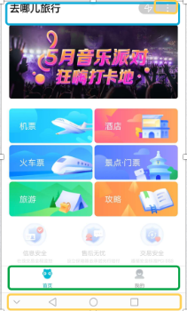

# 页面的各个功能讲解

在娜娜奇中，页面的许多功能是由配置对象与钩子提供。



从上到下，划分成几个功能区，标题栏（titleBar）, 右上角按钮（会弹出菜单，里面包含转发，创建快捷方式到桌面，关于等功能），内容区（这是由页面组件的JSX渲染出来的），切换栏(tabBar, 切换小程序、快应用的页面)， 系统导航栏（手机系统级别，放虚拟HOME键, 返回按钮, 切换抽屉）

## 标题栏

```jsx
class P extends React.Component{
    static config = {
        navigationBarBackgroundColor: "#a9ea00",
        navigationBarTextStyle: "back",
        navigationBarTitleText: "用户中心"
    }
    render(){
        return <div>.....</div>
    }
}
```

如果页面没有配置标题栏，那么它就会使用app.js中的标题栏。
如果想隐藏标题栏，可以在配置对象 navigationStyle:custom， 那么它就会自动消失。

在快应用要隐藏某一个页面的titleBar, 需要manifest.json中配置。但放心，娜娜奇已经帮你屏蔽掉。

```json
 "display": {
    "backgroundColor": "#ffffff", 
    "fullScreen": false,
    "menu": true,                         //右上角菜单
    "titleBar": true,                     //app级别
    "titleBarBackgroundColor": "#000000", //app级别
    "titleBarTextColor": "#fffff",        //app级别
    "pages": {
      "Hello": {  //对应某一个页面的ID
        "backgroundColor": "#eeeeee",
        "fullScreen": true,
        "titleBarBackgroundColor": "#0000ff",   //page级别
        "titleBarText": "Hello",                //page级别
        "orientation": "landscape"              //page级别
        //  "titleBar": true/false
      }
    }
  },

```

| 与标题栏相关的配置项         | 类型                                            | 默认值             | 说明                                                  |
|------------------------------|-------------------------------------------------|--------------------|-------------------------------------------------------|
| navigationBarBackgroundColor | HexColor                                        | #000000            | 导航栏背景颜色，如 #000000                            |
| navigationBarTextStyle       | string	white	导航栏标题颜色，仅支持 black / white |                    |                                                       |
| navigationBarTitleText       | string                                          | 导航栏标题文字内容 |                                                       |
| navigationStyle              | string                                          | default            | 显示标题用default，隐藏用custom，这时只保留右上角按钮 |


想动态设置页面的标题栏可以使用下面API

- `React.api.setNavigationBarTitle({title})`
- `React.api.setNavigationBarColor({frontColor, backgroundColor})`

微信客户端 6.7.2 版本开始，navigationStyle: custom 对 `<web-view>` 组件无效

webview里面的相关操作

```javascript
//仅支持微信小程序
document.addEventListener('WeixinJSBridgeReady', function onBridgeReady() {
    // 通过下面这个API隐藏底部导航栏
    WeixinJSBridge.call('hideToolbar');
});
            
document.addEventListener('WeixinJSBridgeReady', function onBridgeReady() {
    // 通过下面这个API显示底部导航栏
    WeixinJSBridge.call('showToolbar');
}）
```

## 右上角按钮

在原生微信小程序中，只要onShareAppMessage定义就会出现右上角菜单。在娜娜奇中，右上角菜单则总是存在， 并且这个钩子也改名，简化为更好记的onShare, 如果页面没有定义onShare钩子, 它就会使用app.js的全局钩子onGlobalShare

```javascript
class P extends React.Component{
    static config = {
        navigationBarBackgroundColor: "#a9ea00",
        navigationBarTextStyle: "back",
        navigationBarTitleText: "用户中心"
    }
    onShare(){
        return {
            title: '预订火车票 - 去哪儿旅行',
            imageUrl: 'https://s.aaa.com/bbb/ccc.jpg',
            path: `xx/yy`
        }
    }
    render(){
        return <div>.....</div>
    }
}
```

如果想兼容快应用， 还需要在app.js添加一个onShowMenu钩子， 详见[转发分享](./share.md) 

想动态设置右上角按钮可以使用下面API

- `React.api.showShareMenu()` 快应用不支持
- `React.api.hideShareMenu()` 快应用不支持

隐藏微信网页右上角按钮

```javascript
document.addEventListener('WeixinJSBridgeReady', function onBridgeReady() {
    // 通过下面这个API隐藏右上角按钮
    WeixinJSBridge.call('hideOptionMenu');
});
document.addEventListener('WeixinJSBridgeReady', function onBridgeReady() {
    // 通过下面这个API显示右上角按钮
    WeixinJSBridge.call('showOptionMenu');
})
```

## 切换栏

这是一个非常复杂的功能，涉及众多配置项，但我们要求遵循微信的配置名。如果当前页面config没有tabBar配置对象， 那么我们就使用app.js中的tabBar配置对象。

```javascript
//app.js
class Global extends React.Component {
	static config = {
	    window: {
	        backgroundTextStyle: 'light',
	        navigationBarTitleText: 'mpreact',
			navigationBarTextStyle: 'white'
	    },
	    tabBar: {
	        color: '#929292',
	        selectedColor: '#00bcd4',
	        borderStyle: 'black',
	        backgroundColor: '#ffffff',
	        list: [
	            {
	                pagePath: 'pages/index/index',
	                iconPath: '/assets/image/homepage_normal.png',
	                selectedIconPath: '/assets/image/homepage_select.png',
	                text: '首页'
	            },
	            {
	                pagePath: 'pages/demo/question/index/index',
	                iconPath: '/assets/image/question_normal.png',
	                selectedIconPath: '/assets/image/question_select.png',
	                text: '问答社区'
	            },
	            {
	                pagePath: 'pages/demo/userCenter/index',
	                iconPath: '/assets/image/uc_normal.png',
	                selectedIconPath: '/assets/image/uc_select.png',
	                text: '我的'
	            }
	        ]
	    }
	};
    render(){
       return null
    }

// pages/page1/index.js 由于存在tabBar配置对象，但是list的长度为零，不会显示 tabBar
class P1 extends React.Component {
    static config = { 
	    tabBar: {
	        color: '#929292',
	        selectedColor: '#00bcd4',
	        borderStyle: 'black',
	        backgroundColor: '#ffffff',
	        list: []
        }
    }
     render(){
       return <div>page1</div>
    }
}


// pages/page2/index.js 由于没有tabBar配置对象，这时此页面有tabBar,为app.js所定义的那样
class P2 extends React.Component {
    static config = { 
    }
     render(){
       return <div>page2</div>
    }
}
```

想动态设置tabBar可以使用下面API

- React.api.showTabBar()  快应用不支持
- React.api.hideTabBar()  快应用不支持


 ## 系统导航栏

它只与快应用页面的onBackPress钩子有关。

当用户点击返回实体按键、左上角返回菜单、调用返回API时触发该事件

如果事件响应方法最后返回true表示不返回，自己处理业务逻辑（完毕后开发者自行调用 API 返回）；否则：不返回数据，或者返回其它数据：表示遵循系统逻辑：返回到上一页

```javascript
class P2 extends React.Component {
    static config = { 
    }
    onBackPress(){ 
         //让用户操作无效
        return true
    }
    render(){
       return <div>page2</div>
    }
}
```