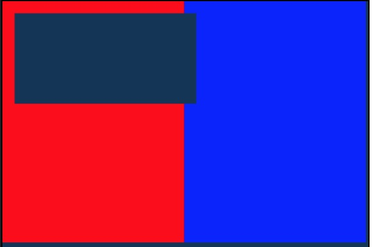
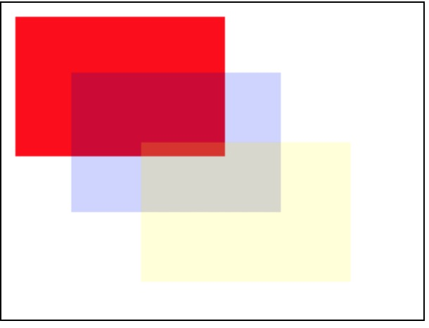

# 画布

## createCanvasContext(canvasId)

```
const ctx = React.api.createCanvasContext('myCanvas', this);  // 在快应用中this必须添加
```

> Tips: 快应用 canvas API


1. 调用的时间是在 onShow  绘制图片， 如果是 组件的话在componentDidMount 中延迟 300 ms
2. setShadow 没有这个属性
3. createCircularGradient   创建圆形渐变属性没有
4. canvasToTempFilePath   把当前画布指定区域的内容导出生成指定大小的图片  该方法没有

创建 canvas 绘图上下文

> 该绘图上下文只作用于对应 canvasId 的 `<canvas />`

**入参**

| 参数     | 类型   | 说明           |
| -------- | ------ | -------------- |
| canvasId | String | 定义在 上的 id |

返回值  
CanvasContext

## CanvasContext.setTextAlign(string align)

设置文字的对齐

**入参**

| 参数      | 类型   | 说明                                       |
| --------- | ------ | ------------------------------------------ |
| textAlign | String | 枚举 "left" "right" "center" "start" "end" |

示例代码：

```javascript
  componentDidMount() {
    const ctx = React.api.createCanvasContext('myCanvas');

    ctx.setStrokeStyle('red');
    ctx.moveTo(150, 20);
    ctx.lineTo(150, 170);
    ctx.stroke();

    ctx.setFontSize(15);
    ctx.setTextAlign('left');
    ctx.fillText('textAlign=left', 150, 60);

    ctx.setTextAlign('center');
    ctx.fillText('textAlign=center', 150, 80);

    ctx.setTextAlign('right');
    ctx.fillText('textAlign=right', 150, 100);

    ctx.draw();

  }
  render() {
    return (
      <div>
        <canvas id="myCanvas"></canvas>
      </div>
    );
  }
```


## CanvasContext.setTextBaseline(string textBaseline)

设置文字的竖直对齐

**入参**

| 参数         | 类型   | 说明                                                              |
| ------------ | ------ | ----------------------------------------------------------------- |
| textBaseline | String | 枚举 "top" "hanging" "middle" "alphabetic" "ideographic" "bottom" |

## CanvasContext.setFillStyle(string color)

设置填充色。默认颜色为 black。

**入参**

| 参数  | 类型  | 说明            |
| ----- | ----- | --------------- |
| color | Color | Gradient Object |

## CanvasContext.setStrokeStyle(string color)

设置描边颜色。默认颜色为 black。

**入参**

| 参数  | 类型  | 说明            |
| ----- | ----- | --------------- |
| color | Color | Gradient Object |

## CanvasContext.setShadow(number offsetX, number offsetY, number blur, string color)

设定阴影样式

> 如果没有设置，offsetX 默认值为 0， offsetY 默认值为 0， blur 默认值为 0，color 默认值为 black。

**入参**

| 参数    | 类型   | 范围  | 说明                         |
| ------- | ------ | ----- | ---------------------------- |
| offsetX | Number |       | 阴影相对于形状水平方向的偏移 |
| offsetY | Number |       | 阴影相对于形状竖直方向的偏移 |
| blur    | Number | 0~100 | 阴影的模糊级别，值越大越模糊 |
| color   | Color  |       | 阴影颜色                     |

## CanvasContext.createLinearGradient(number x0, number y0, number x1, number y1)

创建一个线性的渐变颜色

> 需要使用 addColorStop() 来指定渐变点，至少需要两个。

| 参数 | 类型   | 说明        |
| ---- | ------ | ----------- |
| x0   | Number | 起点 x 坐标 |
| y0   | Number | 起点 y 坐标 |
| x1   | Number | 终点 x 坐标 |
| y1   | Number | 终点 y 坐标 |

代码示例：

```javascript
const ctx = React.api.createCanvasContext('awesomeCanvas');

const grd = ctx.createLinearGradient(10, 10, 150, 10);
grd.addColorStop(0, 'yellow');
grd.addColorStop(1, 'blue');

ctx.setFillStyle(grd);
ctx.fillRect(20, 20, 250, 180);
ctx.draw();
```

## CanvasContext.createCircularGradient(number x0, number y0, number x1, number y1)

创建一个圆形的渐变颜色

> 需要使用 addColorStop() 来指定渐变点，至少需要两个。

| 参数 | 类型   | 说明        |
| ---- | ------ | ----------- |
| x    | Number | 圆心 x 坐标 |
| y    | Number | 圆心 y 坐标 |
| r    | Number | 圆半径      |

代码示例：

```javascript
const ctx = React.api.createCanvasContext('awesomeCanvas');

const grd = ctx.createCircularGradient(90, 60, 60);
grd.addColorStop(0, 'blue');
grd.addColorStop(1, 'red');

ctx.setFillStyle(grd);
ctx.fillRect(20, 20, 250, 180);
ctx.draw();
```


## CanvasGradient.addColorStop(number stop, string color)

创建一个颜色的渐变点。

> 小于最小 stop 的部分会按最小 stop 的 color 来渲染，大于最大 stop 的部分会按最大 stop 的 color 来渲染。
> 需要使用 addColorStop() 来指定渐变点，至少需要两个

| 参数  | 类型   | 说明                                        |
| ----- | ------ | ------------------------------------------- |
| stop  | Number | 表示渐变点在起点和终点中的位置，范围 0 ～ 1 |
| color | Color  | 渐变点颜色                                  |

## CanvasContext.setLineWidth(number lineWidth)

设置线条的宽度

| 参数      | 类型   | 说明                |
| --------- | ------ | ------------------- |
| lineWidth | Number | 线条宽度，单位为 px |

## CanvasContext.setLineCap(string lineCap)

设置线条的端点样式

| 参数    | 类型   | 说明               |
| ------- | ------ | ------------------ |
| lineCap | String | 线条的结束端点样式 |

lineCap 的合法值

| 值     | 说明                           |
| ------ | ------------------------------ |
| butt   | 向线条的每个末端添加平直的边缘 |
| round  | 向线条的每个末端添加圆形线帽   |
| square | 向线条的每个末端添加正方形线帽 |

## CanvasContext.setLineJoin(string lineJoin)

设置线条的交点样式

**入参**

| 参数     | 类型   | 说明               |
| -------- | ------ | ------------------ |
| lineJoin | String | 线条的结束端点样式 |

lineJoin 的合法值

| 值    | 说明 |
| ----- | ---- |
| bevel | 斜角 |
| round | 圆角 |
| miter | 尖角 |

## CanvasContext.setMiterLimit(number miterLimit)

设置最大斜接长度，斜接长度指的是在两条线交汇处内角和外角之间的距离。 当 setLineJoin() 为 miter 时才有效。超过最大倾斜长度的，连接处将以 lineJoin 为 bevel 来显示

**入参**

| 参数       | 类型   | 说明         |
| ---------- | ------ | ------------ |
| miterLimit | Number | 最大斜接长度 |

## CanvasContext.rect(number x, number y, number width, number height)

创建一个矩形路径。

**入参**

| 参数   | 类型   | 说明                |
| ------ | ------ | ------------------- |
| x      | Number | 矩形左上角的 x 坐标 |
| y      | Number | 矩形左上角的 y 坐标 |
| width  | Number | 矩形路径宽度        |
| height | Number | 矩形路径宽度        |

## CanvasContext.fillRect(number x, number y, number width, number height)

填充一个矩形

**入参**

| 参数   | 类型   | 说明                |
| ------ | ------ | ------------------- |
| x      | Number | 矩形左上角的 x 坐标 |
| y      | Number | 矩形左上角的 y 坐标 |
| width  | Number | 矩形路径宽度        |
| height | Number | 矩形路径宽度        |

## CanvasContext.strokeRect(number x, number y, number width, number height)

画一个矩形(非填充)

**入参**

| 参数   | 类型   | 说明                |
| ------ | ------ | ------------------- |
| x      | Number | 矩形左上角的 x 坐标 |
| y      | Number | 矩形左上角的 y 坐标 |
| width  | Number | 矩形路径宽度        |
| height | Number | 矩形路径宽度        |

代码示例：

```javascript
const ctx = React.api.createCanvasContext('awesomeCanvas');
ctx.setStrokeStyle('blue');
ctx.strokeRect(20, 20, 250, 80);
ctx.draw();
```

## CanvasContext.clearRect(number x, number y, number width, number height)

清除画布上在该矩形区域内的内容

**入参**

| 参数   | 类型   | 说明                |
| ------ | ------ | ------------------- |
| x      | Number | 矩形左上角的 x 坐标 |
| y      | Number | 矩形左上角的 y 坐标 |
| width  | Number | 矩形路径宽度        |
| height | Number | 矩形路径宽度        |

代码示例：

```javascript
  componentDidMount() {
    const ctx = React.api.createCanvasContext('myCanvas');
    ctx.setFillStyle('red');
    ctx.fillRect(0, 0, 150, 200);
    ctx.setFillStyle('blue');
    ctx.fillRect(150, 0, 150, 200);
    ctx.clearRect(10, 10, 150, 75);
    ctx.draw();
  }
  render() {
    return (
      <div>
        <canvas id="myCanvas" style="border: 1px solid; background: #123456;" />
      </div>
    );
  }
```



## CanvasContext.fill()

对当前路径中的内容进行填充。默认的填充色为黑色。

如果当前路径没有闭合，fill() 方法会将起点和终点进行连接，然后填充。

代码示例：

```javascript
const ctx = React.api.createCanvasContext('myCanvas');
ctx.moveTo(10, 10);
ctx.lineTo(100, 10);
ctx.lineTo(100, 100);
ctx.fill();
ctx.draw();
```


fill() 填充的的路径是从 beginPath() 开始计算，但是不会将 fillRect() 包含进去。

代码示例：

```javascript
const ctx = React.api.createCanvasContext('myCanvas');
// begin path
ctx.rect(10, 10, 100, 30);
ctx.setFillStyle('yellow');
ctx.fill();

// begin another path
ctx.beginPath();
ctx.rect(10, 40, 100, 30);

// only fill this rect, not in current path
ctx.setFillStyle('blue');
ctx.fillRect(10, 70, 100, 30);

ctx.rect(10, 100, 100, 30);

// it will fill current path
ctx.setFillStyle('red');
ctx.fill();
ctx.draw();
```


## CanvasContext.stroke()

画出当前路径的边框，默认颜色色为黑色。

代码示例：

```javascript
const ctx = React.api.createCanvasContext('myCanvas');
ctx.moveTo(10, 10);
ctx.lineTo(100, 10);
ctx.lineTo(100, 100);
ctx.stroke();
ctx.draw();
```

stroke() 描绘的的路径是从 beginPath() 开始计算，但是不会将 strokeRect() 包含进去。

代码示例：

```javascript
const ctx = React.api.createCanvasContext('myCanvas');
// begin path
ctx.rect(10, 10, 100, 30);
ctx.setStrokeStyle('yellow');
ctx.stroke();

// begin another path
ctx.beginPath();
ctx.rect(10, 40, 100, 30);

// only stoke this rect, not in current path
ctx.setStrokeStyle('blue');
ctx.strokeRect(10, 70, 100, 30);

ctx.rect(10, 100, 100, 30);

// it will stroke current path
ctx.setStrokeStyle('red');
ctx.stroke();
ctx.draw();
```

## CanvasContext.beginPath()

开始创建一个路径，需要调用 fill 或者 stroke 才会使用路径进行填充或描边

## CanvasContext.closePath()

关闭一个路径

> 关闭路径会连接起点和终点

> 如果关闭路径后没有调用 fill() 或者 stroke() 并开启了新的路径，那之前的路径将不会被渲染。

代码示例：

```javascript
const ctx = React.api.createCanvasContext('myCanvas');
ctx.moveTo(10, 10);
ctx.lineTo(100, 10);
ctx.lineTo(100, 100);
ctx.closePath();
ctx.stroke();
ctx.draw();
```


## CanvasContext.moveTo(number x, number y)

把路径移动到画布中的指定点，不创建线条。

**入参**

| 参数 | 类型   | 说明            |
| ---- | ------ | --------------- |
| x    | Number | 目标位置 x 坐标 |
| y    | Number | 目标位置 y 坐标 |

## CanvasContext.lineTo(number x, number y)

lineTo 方法增加一个新点，然后创建一条从上次指定点到目标点的线。

> 用 stroke() 方法来画线条

**入参**

| 参数 | 类型   | 说明            |
| ---- | ------ | --------------- |
| x    | Number | 目标位置 x 坐标 |
| y    | Number | 目标位置 y 坐标 |

代码示例：

```javascript
const ctx = React.api.createCanvasContext('myCanvas');
ctx.moveTo(10, 10);
ctx.rect(10, 10, 100, 50);
ctx.lineTo(110, 60);
ctx.stroke();
ctx.draw();
```


## CanvasContext.arc(number x, number y, number r, number sAngle, number eAngle, number counterclockwise)

画一条弧线。

**入参**

| 参数             | 类型    | 说明                                                   |
| ---------------- | ------- | ------------------------------------------------------ |
| x                | Number  | 圆 x 坐标                                              |
| y                | Number  | 圆 y 坐标                                              |
| r                | Number  | 圆 半径                                                |
| sAngle           | Number  | 起始弧度，单位弧度（在 3 点钟方向）                    |
| eAngle           | Number  | 终止弧度                                               |
| counterclockwise | Boolean | 可选，指定弧度的方向是逆时针还是顺时针，默认为 false。 |

代码示例：

```javascript
const ctx = React.api.createCanvasContext('myCanvas');
// Draw coordinates
ctx.arc(100, 75, 50, 0, 2 * Math.PI);
ctx.setFillStyle('#EEEEEE');
ctx.fill();

ctx.beginPath();
ctx.moveTo(40, 75);
ctx.lineTo(160, 75);
ctx.moveTo(100, 15);
ctx.lineTo(100, 135);
ctx.setStrokeStyle('#AAAAAA');
ctx.stroke();

ctx.setFontSize(12);
ctx.setFillStyle('black');
ctx.fillText('0', 165, 78);
ctx.fillText('0.5*PI', 83, 145);
ctx.fillText('1*PI', 15, 78);
ctx.fillText('1.5*PI', 83, 10);

// Draw points
ctx.beginPath();
ctx.arc(100, 75, 2, 0, 2 * Math.PI);
ctx.setFillStyle('lightgreen');
ctx.fill();

ctx.beginPath();
ctx.arc(100, 25, 2, 0, 2 * Math.PI);
ctx.setFillStyle('blue');
ctx.fill();

ctx.beginPath();
ctx.arc(150, 75, 2, 0, 2 * Math.PI);
ctx.setFillStyle('red');
ctx.fill();

// Draw arc
ctx.beginPath();
ctx.arc(100, 75, 50, 0, 1.5 * Math.PI);
ctx.setStrokeStyle('#333333');
ctx.stroke();

ctx.draw();
```


针对 arc(100, 75, 50, 0, 1.5 \* Math.PI)的三个关键坐标如下：

- 绿色: 圆心 (100, 75)
- 红色: 起始弧度 (0)
- 蓝色: 终止弧度 (1.5 \* Math.PI)

## CanvasContext.bezierCurveTo()

创建三次方贝塞尔曲线路径。

> 曲线的起始点为路径中前一个点。

**入参**

| 参数             | 类型    | 说明                      |
| ---------------- | ------- | ------------------------- |
| cp1x             | Number  | 第一个贝塞尔控制点 x 坐标 |
| cp1y             | Number  | 第一个贝塞尔控制点 y 坐标 |
| cp2x             | Number  | 第二个贝塞尔控制点 x 坐标 |
| cp2y             | Number  | 第二个贝塞尔控制点 y 坐标 |
| x                | Number  | 结束点 x 坐标             |
| y                | Number  | 结束点 y 坐标             |

## CanvasContext.clip()

clip() 方法从原始画布中剪切任意形状和尺寸。一旦剪切了某个区域，则所有之后的绘图都会被限制在被剪切的区域内（不能访问画布上的其他区域）。可以在使用 clip() 方法前通过使用 save() 方法对当前画布区域进行保存，并在以后的任意时间对其进行恢复（通过 restore() 方法）。

## CanvasContext.quadraticCurveTo(number cpx, number cpy, number x, number y)

创建二次贝塞尔曲线路径

**入参**

| 参数 | 类型   | 说明                |
| ---- | ------ | ------------------- |
| cpx  | Number | 贝塞尔控制点 x 坐标 |
| cpy  | Number | 贝塞尔控制点 y 坐标 |
| x    | Number | 结束点 x 坐标       |
| y    | Number | 结束点 y 坐标       |

## CanvasContext.scale(number scaleWidth, number scaleHeight)

在调用 scale() 方法后，之后创建的路径其横纵坐标会被缩放。多次调用 scale()，倍数会相乘。

**入参**

| 参数        | 类型   | 说明                                             |
| ----------- | ------ | ------------------------------------------------ |
| scaleWidth  | Number | 横坐标缩放倍数 (1 = 100%，0.5 = 50%，2 = 200%)   |
| scaleHeight | Number | 纵坐标轴缩放倍数 (1 = 100%，0.5 = 50%，2 = 200%) |

代码示例：

```javascript
const ctx = React.api.createCanvasContext('myCanvas');
ctx.strokeRect(10, 10, 25, 15);
ctx.scale(2, 2);
ctx.strokeRect(10, 10, 25, 15);
ctx.scale(2, 2);
ctx.strokeRect(10, 10, 25, 15);

ctx.draw();
```


## CanvasContext.rotate(number rotate)

以原点为中心，原点可以用 translate() 方法修改。顺时针旋转当前坐标轴。多次调用 rotate()，旋转的角度会叠加。

**入参**

| 参数   | 类型   | 说明                                                               |
| ------ | ------ | ------------------------------------------------------------------ |
| rotate | Number | 横旋转角度，以弧度计(degrees \* Math.PI/180；degrees 范围为 0~360) |

## CanvasContext.translate(number x, number y)

对当前坐标系的原点 (0, 0) 进行变换，默认的坐标系原点为页面左上角。

**入参**

| 参数 | 类型   | 说明           |
| ---- | ------ | -------------- |
| x    | Number | 水平坐标平移量 |
| y    | Number | 竖直坐标平移量 |

## CanvasContext.setFontSize(number fontSize)

设置字体的字号

**入参**

| 参数     | 类型   | 说明 |
| -------- | ------ | ---- |
| fontSize | Number | 字号 |

## CanvasContext.fillText(string text, number x, number y, number maxWidth)

在画布上绘制被填充的文本

**入参**

| 参数 | 类型   | 说明           |
| ---- | ------ | -------------- |
| text | String | 文本           |
| x    | Number | 水平坐标平移量 |
| y    | Number | 竖直坐标平移量 |

## CanvasContext.drawImage(string imageResource, number dx, number dy, number dWidth, number dHeight, number sx, number sy, number sWidth, number sHeight)

绘制图像到画布

**入参**

| 参数          | 类型   | 说明              |
| ------------- | ------ | ----------------- |
| imageResource | String |                   |
| x             | Number | 图像左上角 x 坐标 |
| y             | Number | 图像左上角 y 坐标 |
| width         | Number | 图像宽度          |
| height        | Number | 图像高度          |
| sx            | Number | 源图像的矩形选择框的左上角 X 坐标。          |
| sy            | Number | 源图像的矩形选择框的左上角 Y 坐标。          |
| sWidth        | Number | 源图像的矩形选择框的宽度          |
| sHeight       | Number | 源图像的矩形选择框的高度          |

## CanvasContext.setGlobalAlpha(number 透明度。范围)

设置全局画笔透明度。

**入参**

| 参数  | 类型   | 范围   | 说明                                 |
| ----- | ------ | ------ | ------------------------------------ |
| alpha | Number | 0 ～ 1 | 透明度，0 表示完全透明，1 表示不透明 |

代码示例：

```javascript
const ctx = React.api.createCanvasContext('myCanvas');
ctx.setFillStyle('red');
ctx.fillRect(10, 10, 150, 100);
ctx.setGlobalAlpha(0.2);
ctx.setFillStyle('blue');
ctx.fillRect(50, 50, 150, 100);
ctx.setFillStyle('yellow');
ctx.fillRect(100, 100, 150, 100);

ctx.draw();
```



## CanvasContext.setLineDash(Array.<number> pattern, number offset)

设置虚线的样式

**入参**

| 参数     | 类型   | 说明                                 | 支持平台 |
| -------- | ------ | ------------------------------------ | -------- |
| segments | Array  | 透明度，0 表示完全透明，1 表示不透明 | 都支持   |
| offset   | Number | 虚线偏移量                           | 微信     |

## CanvasContext.transform(number scaleX, number skewX, number skewY, number scaleY, number translateX, number translateY)

使用矩阵多次叠加当前变换的方法，矩阵由方法的参数进行描述。你可以缩放、旋转、移动和倾斜上下文。

**入参**

| 参数       | 类型   | 说明     |
| ---------- | ------ | -------- |
| scaleX     | String | 水平缩放 |
| skewX      | Number | 水平倾斜 |
| skewY      | Number | 垂直倾斜 |
| scaleY     | Number | 垂直缩放 |
| translateX | Number | 水平移动 |
| translateX | Number | 垂直移动 |

代码示例：

```javascript
const ctx = React.api.createCanvasContext('myCanvas');

ctx.rotate((45 * Math.PI) / 180);
ctx.setFillStyle('red');
ctx.fillRect(70, 0, 100, 30);

ctx.transform(1, 1, 0, 1, 0, 0);
ctx.setFillStyle('#000');
ctx.fillRect(0, 0, 100, 100);

ctx.draw();
```


## CanvasContext.setTransform(number scaleX, number skewX, number skewY, number scaleY, number translateX, number translateY)

使用矩阵重新设置（覆盖）当前变换的方法

**入参**

| 参数       | 类型   | 说明     |
| ---------- | ------ | -------- |
| scaleX     | String | 水平缩放 |
| skewX      | Number | 水平倾斜 |
| skewY      | Number | 垂直倾斜 |
| scaleY     | Number | 垂直缩放 |
| translateX | Number | 水平移动 |
| translateX | Number | 垂直移动 |

## CanvasContext.save()

保存绘图上下文。

## CanvasContext.restore()
恢复之前保存的绘图上下文。

## CanvasContext.draw(boolean reserve, function callback)

将之前在绘图上下文中的描述（路径、变形、样式）画到 canvas 中。

**入参**

| 参数     | 类型   | 说明                                 | 支持平台 |
| -------- | ------ | ------------------------------------ | -------- |
| reserve | Boolean  | 非必填。本次绘制是否接着上一次绘制，即 reserve 参数为 false 时则在本次调用 drawCanvas绘制之前 native 层应先清空画布再继续绘制；若 reserver 参数为true 时，则保留当前画布上的内容，本次调用drawCanvas绘制的内容覆盖在上面，默认 false| 都支持   |
| callback   | Function |绘制完成后执行的回调函数                           | 微信，百度     |

## Object CanvasContext.measureText(string text)

测量文本尺寸信息，目前仅返回文本宽度。同步接口。

**入参**

| 参数       | 类型   | 说明     |
| ---------- | ------ | -------- |
| text     | String |必填。要测量的文本 |

**返回**

返回 TextMetrics 对象，结构如下：

| 参数       | 类型   | 说明     |
| ---------- | ------ | -------- |
| width     | Number |文本的宽度 |

代码示例：

```javascript
const ctx = React.api.createCanvasContext('myCanvas');

ctx.font = 'italic bold 50px cursive';
const { width } = ctx.measureText('hello world');
console.log(width);
```

## CanvasContext.canvasToTempFilePath(OBJECT, this)

把当前画布指定区域的内容导出生成指定大小的图片，并返回文件路劲。在自定义组件下，第二个参数传入组件实例this，以操作组件内`<canvas/>`组件。

**入参**

| 参数      | 类型   | 说明                                       |
| --------- | ------ | ------------------------------------------ |
| x | Number | 画布 x 轴起点（默认 0 ） |
| y | Number | 画布 y 轴起点（默认 0 ） |
| width | Number | 画布宽度（默认为 canvas 宽度 -x） |
| height | Number | 画布高度（默认为 canvas 高度 -y） |
| destWidth | Number | 输出图片宽度（默认为 width * 屏幕像素密度） |
| destHeight | Number | 输出图片高度（默认为 height * 屏幕像素密度） |
| canvasId | String | 画布标识，传入`<canvas/>`的 canvas-id |
| fileType | String | 目标文件的类型，只支持 ‘jpg’ 或 ‘png’，默认为 ‘png’ 。 |
| quality | Number | 图片的质量，取值范围为 (0, 1]，不在范围内时当作 1.0 处理 。 |
| success | Function | 接口调用成功的回调函数 |
| fail | Function | 接口调用失败的回调函数 |
| complete | Function | 接口调用结束的回调函数（调用成功、失败都会执行） |

在 draw 回调里调用该方法才能保证图片导出成功。

示例代码：

```javascript
  React.api.canvasToTempFilePath({
    x: 100,
    y: 200,
    width: 50,
    height: 50,
    destWidth: 100,
    destHeight: 100,
    canvasId: 'myCanvas',
    success: function(res) {
        console.log(res.tempFilePath)
    }
});
```
