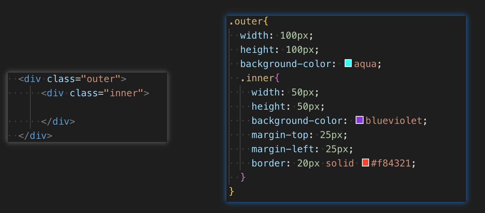

# 微信/快应用盒子模型的区别

### box-sizing 的区别

* 在微信小程序中，盒子的 `box-sizing` 属性默认是 `content-box`
* 在快应用中，盒子的 `box-sizing` 属性默认是 `border-box`

* 很明显在快应用下：为元素设定的宽度和高度决定了元素的边框盒，元素指定的任何内边距和边框都将在已设定的宽度和高度内进行绘制
* 在微信小程序下：在宽度和高度之外绘制元素的内边距和边框，如有需要，在微信下可以手动加上 `box-sizing: border-box;` 让其和快应用表现一致

### margin-top 的区别

* 如图，在快应用下：`.inner{margin-top:25px}` 是如我们期望的方式呈现的
* 在微信小程序里面：子层和父层贴边了，而父层和上部层却间隔 `25px`
  * 当两个容器嵌套时,如果外层容器和内层容器之间没有别的元素,编辑器会把内层元素的margin-top作用与父元素，也就是说因为子层是父层的第一个非空子元素，在微信里面使用margin-top会发生这个错误
  * 解决办法：可以给父层 加 `padding-top`

