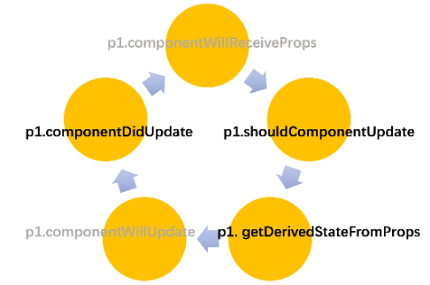
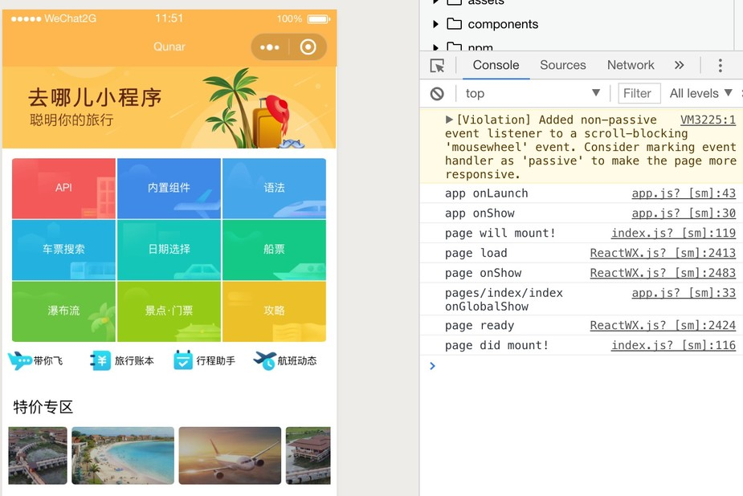

# 页面组件与生命周期

一个应用是由许多页面组成，这些页面的文件名都是index.js, 它们都必须放在pages/xxx目录中。xxx为一个文件夹，里面通常有index.js, index.scss或index.less.

其次， 页面组件必须是一个有状态的 React 组件， 第一行必须为`import React from '@react'`。

再次， 页面组件必须有render方法， 并且JSX只能出现在render方法中，不能出现在其他方法里面。JSX也不能用`React.createElement()`代替。因此render方法的JSX会被抽取出来，编译成`wxml`, `axml`, `swan`等文件。有关 JSX 的注意事项可以看[这里](jsx.md)。


```jsx
//pages/train/index.js
import React from '@react';

class P extends React.Component {
  constructor() {
    super();
    this.state = {
      iconSize: [20, 30, 40, 50, 60, 70],
      text: 'this is first line\nthis is second line'
    };
  }
  static config = {
    "navigationBarBackgroundColor": "#ffffff",
    "navigationBarTextStyle": "black",
    "navigationBarTitleText": "微信接口功能演示",
    "backgroundColor": "#eeeeee",
    "backgroundTextStyle": "light"
  };

  add() {
    this.setState({
      text: this.state.text + '\nthis is new line'
    });
  }

  remove() {
    var textAry = this.state.text.split('\n');
    if (!textAry.length) return;
    textAry.pop();

    this.setState({
      text: textAry.join('\n')
    });
  }
  static getDerivedStateFromProps(){} //React 16新钩子
  componentWillMount() { }      //React 16 声明废弃的钩子
  componentDidMount() {}        //React 5  的钩子
  componentWillReceiveProps(){} //React 16 声明废弃的钩子
  shouldComponentUpdate(){}     //React 5  的钩子
  componentWillUpdate(){}       //React 16 声明废弃的钩子
  componentDidUpdate(){}        //React 5  的钩子
  componentWillUnmount(){}      //React 5  的钩子
  onShow(){}                  //小程序页面的钩子 路由
  onHide(){}                  //小程序页面的钩子 路由
  onResize(){}                //小程序页面的钩子 页面大小变动
  onShare(){}                 //小程序页面的钩子 转发
  onPullDownRefresh(){}       //小程序页面的钩子 滚动
  onReachBottom(){}           //小程序页面的钩子 滚动
  onPageScroll(){}            //小程序页面的钩子 滚动
  onTabItemTap(){}            //小程序页面的钩子 TAB点击
  render() {
    return (
      <div class="container">
        <div class="item-list">
          <h2 class="item-list-hd">Icon</h2>
          <div class="group">
            {this.state.iconSize.map(function(item) {
              return <icon type="success" size={item} />;
            })}
          </div>
        </div>
      </div>
    );
  }
}

export default P;
```
## 页面组件的配置对象

其实就是来源于[微信小程序官网](https://developers.weixin.qq.com/miniprogram/dev/framework/config.html#%E9%A1%B5%E9%9D%A2%E9%85%8D%E7%BD%AE)

|  属性   | 类型 | 	默认值 |描述 |
| --- | --- | --- |---|
| navigationBarBackgroundColor | HexColor | #000000 |导航栏背景颜色，如 #ff0000|
| navigationBarTextStyle       | String   | white | 导航栏标题颜色，仅支持 black / white|
| navigationBarTitleText	     |String	  | &nbsp;  |	导航栏标题文字内容|
| backgroundColor	             |HexColor  |	#ffffff	|窗口的背景色      |
| enablePullDownRefresh	       |Boolean  	|false	  |是否全局开启下拉刷新|
| tabBar	                     |Object  	|null	    |如果tabBar已定义，并且里面有list数组|

## 页面组件的生命周期

由于页面组件也是一个React有状态组件, 因此它拥有React15/16的所有钩子。


当我们打开一个页面，页面组件会依次触发如下生命周期钩子


如果对页面组件进行setState,会依次触发如下生命周期钩子



>componentWillMount/Update/ReceiveProps这三个钩子是 React15的旧钩子，如果定义了它们
> 就不会触发React 16的新钩子getDerivedStateFromProps

如果用户从页面1跳转到页面2，是不会触页面组件的componentWillUnmount(即onUnload),而是触发页面的onHide钩子与
app.js上的onGlobalHide钩子。然后再依次触发页面2的componentWillMount，onGlobalLoad，onShow。。。


页面销毁时，会先触发所有子组件的componentWillUnmount，再到页面的componentWillUnmount，最后是app.js的
onGlobalUnload钩子


当然，除了页面的生命周期及页面上所有子组件的生命周期，应用本身还有生命周期，实际上我们看到的生命周期触发顺序是这样的。




注： 页面组件必须使用 es6 风格来引入依赖与导出自己。

它的静态属性 config 会抽取出来生成对应的 JSON 配置对象，有关配置项可以看[这里](https://developers.weixin.qq.com/miniprogram/dev/framework/config.html#%E9%A1%B5%E9%9D%A2%E9%85%8D%E7%BD%AE)


## 页面事件

除了生命周期钩子， 有一些页面事件，都是以onXXX命名。如果用户没有定义这些页面事件， 框架还会尝试访问app.js中的以onGlobalXXX命名的方法，作为它的后备方案。


|页面事件名	  |全局事件名    |	  说明   |  关系 |
|:---------|:-------------|-------|-------|
|onShow(query)   	|onGlobalShow(query)	   |query对象 |总是触发全局事件    |
|onHide   	|onGlobalHide	   |没有参数 |总是触发全局事件    |
|页面初次被打开   |onGlobalLoad	   |没有参数 |总是触发全局事件    |
|页面初次渲染完   |onGlobalReady	 |没有参数 |总是触发全局事件    |
|页面被销毁   |onGlobalUnload	 |没有参数 |总是触发全局事件    |
|onResize 	|X	| 有参数, {size } |没有全局事件    |
|onShare/onShareAppMessage|onGlobalShare	|有参数, 有返回值,{from,target,webViewUrl}|有页面就没有全局    |
|onPageScroll    	 |	X |有参数,{scrollTop} |没有全局事件    |
|onReachBottom    |X |没有参数  |没有全局事件    |
|onPullDownRefresh |X |没有参数 |没有全局事件    |
|onTabItemTap      |X |有参数{index,pagePath,text}| 没有全局事件   |


## 页面组件的JS文件名必须为index.js的原因

主要是为了兼容快应用。快应用有一个manifest.json文件, 里面有一个router对象，包含所有页面
```json
"router": {
    "entry": "pages/index",
    "pages": {
      "pages/index": {
        "component": "index"
      },
      "pages/demo/syntax/index": {
        "component": "index"
      },
      "pages/demo/syntax/api": {
        "component": "index"
      },
      "pages/demo/syntax/await": {
        "component": "index"
      },
      "pages/demo/syntax/children": {
        "component": "index"
      },
      "pages/demo/syntax/extend": {
        "component": "index"
      },
      "pages/demo/syntax/if": {
        "component": "index"
      }
    }
}
```

然后我们页面切换是通过React.api.redirectTo实现
```javascript
function createRouter(name) {
    return function (obj) {
        var router = require('@system.router');
        var params = {};
        var uri = obj.url.slice(obj.url.indexOf('/pages') + 1);
        uri = uri.replace(/\?(.*)/, function (a, b) {
            b.split('=').forEach(function (k, v) {
                params[k] = v;
            });
            return '';
        }).replace(/\/index$/, '');
        console.log(uri, "createRouter")
        router[name]({
            uri:"/"+ uri,
            params: params
        });
    };
}
```

