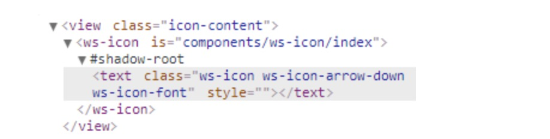
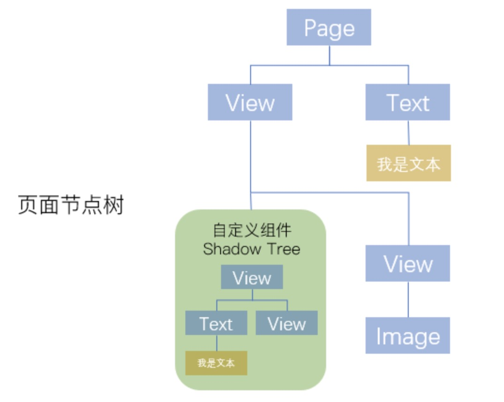

# 微信小程序的双线程架构

>节选自微保@梁沛聪 的《 微信小程序渲染性能调优》

>@梁沛聪，微保技术部-架构平台中心高级前端开发，负责微保小程序基础库搭建、车险业务开发等工作，对小程序性能优化有深入地实践。

>为了叙述方便，下文会把微信小程序简称为小程序。


与传统的浏览器Web页面最大区别在于，小程序的是基于 双线程 模型的，在这种架构中，小程序的渲染层使用 WebView 作为渲染载体，而逻辑层则由独立的 JsCore 线程运行 JS 脚本，双方并不具备数据直接共享的通道，因此渲染层和逻辑层的通信要由 Native 的 JSBrigde 做中转。


## 小程序更新视图数据的通信流程

每当小程序视图数据需要更新时，逻辑层会调用小程序宿主环境提供的 setData 方法将数据从逻辑层传递到视图层，经过一系列渲染步骤之后完成UI视图更新。完整的通信流程如下：

1. 小程序逻辑层调用宿主环境的 setData 方法。
2. 逻辑层执行 JSON.stringify 将待传输数据转换成字符串并拼接到特定的JS脚本，并通过evaluateJavascript 执行脚本将数据传输到渲染层。
3. 渲染层接收到后， WebView JS 线程会对脚本进行编译，得到待更新数据后进入渲染队列等待 WebView 线程空闲时进行页面渲染。
4. WebView 线程开始执行渲染时，待更新数据会合并到视图层保留的原始 data 数据，并将新数据套用在WXML片段中得到新的虚拟节点树。经过新虚拟节点树与当前节点树的 diff 对比，将差异部分更新到UI视图。同时，将新的节点树替换旧节点树，用于下一次重渲染。

## 引发渲染性能问题的一些原因

在上述通信流程中，一些不恰当的操作可能会影响到页面渲染的性能。

## setData传递大量的新数据

数据的传输会经历跨线程传输和脚本编译的过程，当数据量过大，会增加脚本编译的执行时间，占用 WebView JS 线程。

下图是我们做的一组测试统计：在相同网络环境下，各个机型分别对大小为1KB、2KB、3KB的数据执行 setData 操作所消耗的时间。


从图中可以看出， setData 数据传输量越大，数据传输所消耗的时间越大。

## 频繁的执行setData操作

频繁的执行 setData 会让 WebView JS 线程一直忙碌于脚本的编译、节点树的对比计算和页面渲染。导致的结果是：

* 页面渲染结果有一定的延时。
* 用户触发页面事件时，因 WebView JS 线程忙碌，用户事件未能及时的传输到逻辑层而导致反馈延迟。

## 过多的页面节点数

* 页面初始渲染时，渲染树的构建、计算节点几何信息以及绘制节点到屏幕的时间开销都跟页面节点数量成正相关关系，页面节点数量越多，渲染耗时越长。
* 每次执行 setData 更新视图，WebView JS 线程都要遍历节点树计算新旧节点数差异部分。当页面节点数量越多，计算的时间开销越大，减少节点树节点数量可以有效降低重渲染的时间开销。

## 渲染性能优化

基于引发渲染性能问题的原因，我们可以制定一些优化策略来避免性能问题的发生。

## setData优化

setData 作为逻辑层与视图层通信的媒介，是最容易造成渲染性能瓶颈的 API 。我们在使用 setData时应该遵循一些规则来尽可能避免性能问题的发生：

## 减少 setData 数据传输量

* 仅传输视图层使用到的数据，其他 JS 环境用到的数据存放到 data 对象外。
* 合理利用局部更新。setData 是支持使用 数据路径 的方式对对象的局部字段进行更新，我们可能会遇到这样的场景：list 列表是从后台获取的数据，并展示在页面上，当 list 列表的第一项数据的 src 字段需要更新时，一般情况下我们会从后台获取新的 list 列表，执行 setData 更新整个 list 列表。

```javascript
// 后台获取列表数据
const list = requestSync(); 

// 更新整个列表
this.setData({ list });
```

实际上，只有个别字段需要更新时，我们可以这么写来避免整个 list 列表更新:

```javascript
// 后台获取列表数据
const list = requestSync(); 

// 局部更新列表
this.setData({ 
  'list[0].src': list[0].src
});
```

## 降低 setData 执行频率

在不影响业务流程的前提下，将多个 setData 调用合并执行，减少线程间通信频次。

当需要在频繁触发的用户事件(如 PageScroll 、 Resize 事件)中调用 setData ，合理的利用 函数防抖(debounce) 和 函数节流(throttle) 可以减少 setData 执行次数。

>函数防抖（debounce）：函数在触发n秒后才执行一次，如果在n秒内重复触发函数，则重新计算时间。
>函数节流（throttle）：单位时间内，只会触发一次函数，如果同一个单位时间内触发多次函数，只会有一次生效。

除了让开发者自觉遵循规则来减少 setData 数据传输量和执行频率之外，我们还可以自己设计一个 diff 算法，重新对 setData 进行封装，使得在 setData 执行之前，让待更新的数据与原 data 数据做 diff 对比，计算出数据差异 patch 对象，判断 patch 对象是否为空，如果为空则跳过执行更新，否则再将 patch 对象执行 setData 操作，从而达到减少数据传输量和降低执行 setData 频率的目的。

```javascript
// setData重新封装成新的方法，使得数据更新前先对新旧数据做diff对比，再执行setData方法
this.update = (data) => {
    return new Promise((resolve, reject) => {
        const result = diff(data, this.data);
        if (!Object.keys(result).length) {
            resolve(null);
            return;
        } 
        this.setData(result, () => {
            resolve(result);
        });
    });
}
```

具体流程如下图：


## 善用自定义组件

小程序自定义组件的实现是由小程序官方设计的 Exparser 框架所支持，框架实现的自定义组件的组件模型与 Web Components 标准的 Shadow DOM 相似：



在页面引用自定义组件后，当初始化页面时，Exparser 会在创建页面实例的同时，也会根据自定义组件的注册信息进行组件实例化，然后根据组件自带的 data 数据和组件WXML，构造出独立的 Shadow Tree ，并追加到页面 Composed Tree 。创建出来的 Shadow Tree 拥有着自己独立的逻辑空间、数据、样式环境及setData调用：



基于自定义组件的 Shadow DOM 模型设计，我们可以将页面中一些需要高频执行 setData 更新的功能模块（如倒计时、进度条等）封装成自定义组件嵌入到页面中。

当这些自定义组件视图需要更新时，执行的是组件自己的 setData ，新旧节点树的对比计算和渲染树的更新都只限于组件内有限的节点数量，有效降低渲染时间开销。

下图是我们在微保小程序WeDrive首页中，将倒计时模块抽取自定义组件前后的setData更新耗时对比：


从图中可以看出，使用自定义组件后，倒计时模块 setData 平均渲染耗时有了非常明显的下降，实际在低端安卓机中体验会感觉明显的更流畅。

当然，并不是使用自定义组件越多会越好，页面每新增一个自定义组件， Exparser 需要多管理一个组件实例，内存消耗会更大，当内存占用上升到一定程度，有可能导致 iOS 将部分 WKWebView 回收，安卓机体验会变得更加卡顿。因此要合理的使用自定义组件，同时页面设计也要注意不滥用标签。

总结

小程序双线程架构决定了数据通信优化会是性能优化中一个比较重要的点。而上述提到的几个优化建议只是优化渲染性能中的一部分，要想让你的页面体验变得更加丝滑，就要熟悉小程序框架的底层原理，根据小程序框架的特点，编写出“合身”的前端代码。