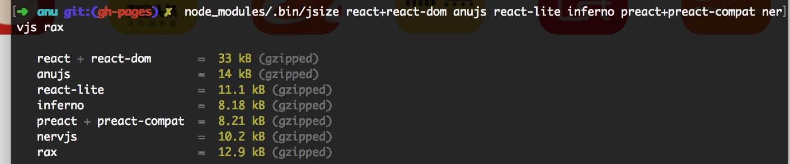

# anu


[](https://github.com/Rubylouvre/anu/blob/master/LICENSE) 
[](https://www.npmjs.com/package/anujs)
[](https://circleci.com/gh/RubyLouvre/anu/tree/master)
[](https://github.com/RubyLouvre/anu/pulls)


**anujs** is a highly React16-compliant Mini React framework that is compatible with  React16.3.0, runs through the official 788 test cases, and supports 99% of the React ecosystem's components and UI libraries.

Chinese users can join QQ group: 370262116


As we all know, React has been criticized for being too big, so I re-implemented React on the basis of reading its source code, and only one third of React+ReactDOM after gz. For detailed data, see https://bundlephobia.com/, anu@1.4.3 is only 13.1 kb, react@16.4.1 is 2.3 kb, and react-dom@16.4.1 is 30.5 kb. If a router is used, react-router-dom@4.3.1 is 11 kb and reach@1.0.1 is 4.3 kb.

## volume ratio

Now React Family Bucket has the following common packages

Package 1:react + react-dom + react-router-dom + redux + react-redux + redux-saga,
Volume is 2.3 + 30.5 + 11 + 5 + 4.3 + 8.4 = **61.4** kb
Suitable for just getting started

Package 2:react + react-dom + react-router-dom + mobx + mobx-react
Volume is 2.3 + 30.5 + 11 + 13.8 + 6.4 = **64** kb
Suitable for people who complain about redux

Package 3: anujs + reach + redux + react-redux + rematch
Volume is 13.1 + 6 + 2.5 + 5 + 4.3 = **31** kb
Suitable for people with requirements for volume, compatibility and ease of use

The measurement tools for the above code are **gzip-size-cli**, **jsize** and https://bundlephobia.com/



## Compared to other mini reacts

The main competition products are `inferno`, `preact`, `rax`, `react-lite`, `nervjs`, the first two are overseas, and the last three are Chinese. China has a relatively high volume due to the state of the Internet.

**inferno**, need to add inferno-compat, in order to be consistent with the official API, but in the case of component suites, the execution order of the life cycle hooks is inconsistent with the official, so it is not compatible with most of React's UI library. Older IE is not supported.

**preact** requires preact-compat to be consistent with the official API. However, in the case of component components, the execution sequence of lifecycle hooks is inconsistent with that of the official. Therefore, it is not compatible with most of React's UI libraries. Preact-compat internally uses Object.definePropety, so it cannot be used in IE8, and it also causes its performance to be severely degraded.

**rax"", launched by China's Alibaba Group, supports most APIs of React16, does not support IE8, can run some React UI libraries.

**react-lite"", launched by China's Ctrip Group, is only compatible with React15, supports IE8, and runs some React UI libraries.

**nervjs**, launched by China's Jingdong Group, supports most of the React16 APIs, code is very similar to inferno, rax, there is no case to prove that it is compatible with IE8, performance indicators are also very suspicious.

## anujs advantage

1. Supports various new features of React16, Fragment, componentDidCatch, creactContext, createRef, forwardRef...
2. Run nearly more than 800 official unit tests (other mini-banks cannot run official tests)
3. Support React Family Reactor (react-redux, react-router-red, react-router-redux, react-lazy-load, react-hot-loader...)
4. Support 99% antd component (antd is China's most famous React UI library)

## Testing

```shell
npm test
```