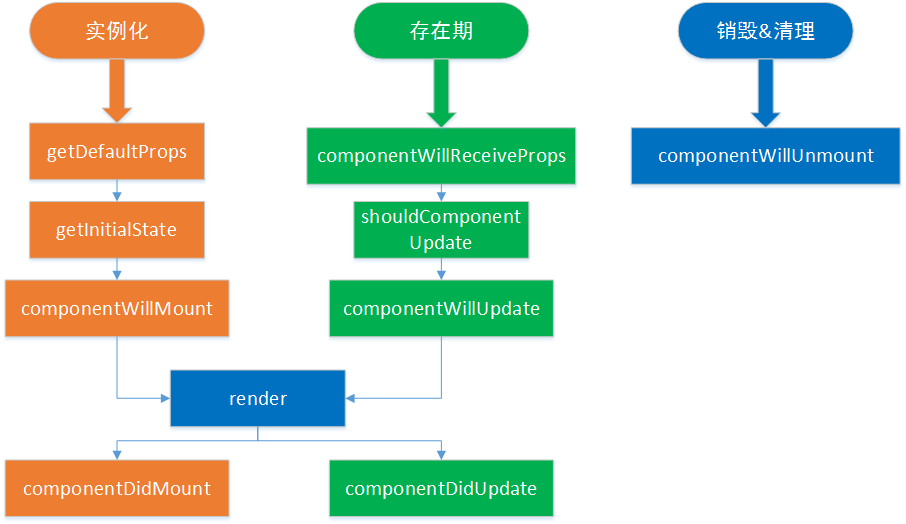

##组件的生命周期钩子

React的组件机制非常出色，不仅在于其标签化的设计，还在于它的生命周期非常完整，在每个阶段都有不同的钩子供你调用。

早期一共有10个钩子，在es6类流行后，精简为8个，getDefaultProps 与	getInitialState被废弃了。

我们可以把组件生命周期大致分为三个阶段：

第一阶段：是组件挂载阶段
1. getDefaultProps 或es6 Class.defaultProps
2. getInitialState 或es6 this.state
3. componentWillMount
4. render
5. componentDidMount

第二阶段：是组件在运行和交互阶段
1. componentWillReceiveProps
2. shouldComponentUpdate
3. componentWillUpdate
4. render
5. componentDidUpdate

第三阶段：是组件卸载阶段
1. componentWillUnmount




说明

###componentWillMount()

在完成首次渲染之前调用，此时仍可以修改组件的state。

####render()

必选的方法，创建虚拟DOM，该方法具有特殊的规则：

    只能通过this.props和this.state访问数据
    可以返回null、false或任何React组件
    只能出现一个顶级组件（不能返回数组）
    不能改变组件的状态
    不能修改DOM的输出

####componentDidMount()

真实的DOM被渲染出来后调用，在该方法中可通过this.getDOMNode()访问到真实的DOM元素。此时已可以使用其他类库来操作这个DOM。

在服务端中，该方法不会被调用。

####componentWillReceiveProps(nextProps, parentContext)

组件接收到上面传下来的props, context做参数，大家可以在这里进行setState操作
```javascript
    componentWillReceiveProps: function(nextProps) {
        if (nextProps.bool) {
            this.setState({
                bool: true
            });
        }
    }
```

####shouldComponentUpdate(nextProps, nextState, parentContext)

组件是否应当渲染新的props或state，返回false表示跳过后续的生命周期方法，通常不需要使用以避免出现bug。
在出现应用的瓶颈时，可通过该方法进行适当的优化。

在首次渲染期间或者调用了forceUpdate方法后，该方法不会被调用

####componentWillUpdate

接收到新的props或者state后，进行渲染之前调用，此时不允许更新props或state。

####componentDidUpdate

完成渲染新的props或者state后调用，此时可以访问到新的DOM元素。

####componentWillUnmount

组件被移除之前被调用，可以用于做一些清理工作，在componentDidMount方法中添加的所有任务都需要在该方法中撤销，
比如创建的定时器或添加的事件监听器。


| 生命周期            |  调用次数 | 能否使用 setSate() |
|---------------------------|:-----:|---------------:|
| componentWillMount        |   1   |              是 |
| render                    |  >=1  |              否 |
| componentDidMount         |   1   |              是 |
| componentWillReceiveProps |  >=0  |              是 |
| shouldComponentUpdate     |  >=0  |              否 |
| componentWillUpdate       |  >=0  |              否 |
| componentDidUpdate        |  >=0  |              否 |
| componentWillUnmount      |   1   |              否 |


```jsx
class LifeCycle extends React.Component {
    constructor(props) {
        super(props);
        alert("Initial render");
        alert("constructor");
        this.state = {str: "hello"};
    }

    componentWillMount() {
        alert("componentWillMount");
    }

    componentDidMount() {
        alert("componentDidMount");
    }

    componentWillReceiveProps(nextProps) {
        alert("componentWillReceiveProps");
    }

    shouldComponentUpdate() {
        alert("shouldComponentUpdate");
        return true;        // 记得要返回true
    }

    componentWillUpdate() {
        alert("componentWillUpdate");
    }

    componentDidUpdate() {
        alert("componentDidUpdate");
    }

    componentWillUnmount() {
        alert("componentWillUnmount");
    }

    setTheState() {
        let s = "hello";
        if (this.state.str === s) {
            s = "HELLO";
        }
        this.setState({
            str: s
        });
    }

    forceItUpdate() {
        this.forceUpdate();
    }

    render() {
        alert("render");
        return(
            <div>
                <span>{"Props:"}<h2>{parseInt(this.props.num)}</h2></span>
                <br />
                <span>{"State:"}<h2>{this.state.str}</h2></span>
            </div>
        );
    }
}

class Container  extends React.Component {
    constructor(props) {
        super(props);
        this.state = {
            num: Math.random() * 100
        };
    }

    propsChange() {
        this.setState({
            num: Math.random() * 100
        });
    }

    setLifeCycleState() {
        this.refs.rLifeCycle.setTheState();
    }

    forceLifeCycleUpdate() {
        this.refs.rLifeCycle.forceItUpdate();
    }

    unmountLifeCycle() {
        // 这里卸载父组件也会导致卸载子组件
        React.unmountComponentAtNode(document.getElementById("container"));
    }

    parentForceUpdate() {
        this.forceUpdate();
    }

    render() {
        return (
            <div>
                <a href="javascript:;" className="weui_btn weui_btn_primary" onClick={this.propsChange.bind(this)}>propsChange</a>
                <a href="javascript:;" className="weui_btn weui_btn_primary" onClick={this.setLifeCycleState.bind(this)}>setState</a>
                <a href="javascript:;" className="weui_btn weui_btn_primary" onClick={this.forceLifeCycleUpdate.bind(this)}>forceUpdate</a>
                <a href="javascript:;" className="weui_btn weui_btn_primary" onClick={this.unmountLifeCycle.bind(this)}>unmount</a>
                <a href="javascript:;" className="weui_btn weui_btn_primary" onClick={this.parentForceUpdate.bind(this)}>parentForceUpdateWithoutChange</a>
                <LifeCycle ref="rLifeCycle" num={this.state.num}></LifeCycle>
            </div>
        );
    }
}

ReactDom.render(
    <Container></Container>,
    document.getElementById('container')
);
```