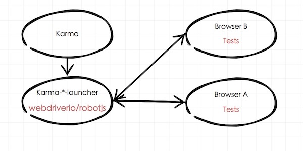

## karma-event-driver-ext

### Introduction
----------------

[](xx)

This project aims to integrate webdriverio into karma, for writing event-drive-tests conveniently.

for example, in your browser side test code, call webdriverio api to simulate dragAndMove behavior:

```jsx
        await browser
            .moveToObject(document.body, 0, 0) // top-left corner
            .buttonDown() // left-mouse down
            .moveTo(null, 0, -100) // mouse-move -100 on the Y-axis
            .buttonUp() // left-mouse up
            .$apply(); // execute
```

#### How it works

browser in karma-event-driver-ext is just a proxy to receive command. while a webdriverio-like api being called, proxy will format arguments received, for example, convert an argument which type is Element to unique query, then call $apply to sends drive-commands to socket server and wait for executing response. 

webdriverio is used to drive the browser and simulate user-behavior.


Tips: 

+ must not hard refresh karma test page [Chrome is fine, while firefox goes wrong unexpectedly]
+ must call $apply, a promise will be returned.
+ if Element has no id, event-drivers-hook js will assign a unique id to it automatically. 
+ aim to simulate event and most webdriverio api support[except $, $$, then and all Window/api]. [more api](http://webdriver.io/api.html)

### requirements

+ [selenium-server-standalone](http://selenium-release.storage.googleapis.com/3.3/selenium-server-standalone-3.3.1.jar)
+ [chromedriver](https://sites.google.com/a/chromium.org/chromedriver/), [more available drivers](http://www.seleniumhq.org/projects/webdriver/)
+ nodejs v6.10.0+
+ karma

then must export path to $PATH where u put drivers* or copy drivers* to project directory. 

### usage

#### npm install

#### karma.conf.js

```jsx
module.exports = {
     customLaunchers: {
        'Chrome': {
            base: 'WebDriverio',
            browserName: 'chrome',
            name: 'Karma'
        },
        'Firefox': {
            base: 'WebDriverio',
            browserName: 'firefox',
            name: 'Karma-Firefox',
            config: {
                browserName: 'firefox',
                host: '127.0.0.1', // default
                port: '4444' // default
            }
        }
    },
    browsers: ['Chrome'],
    ...
}
```

#### Tests code [get webdriverio api](http://webdriver.io/api.html):

##### basic usage

```jsx
    import { beforeHook, beforeEachHook, afterHook, browser, config } from 'karma-event-driver-ext/cjs/event-driver-hooks';
    let { $serial } = browser;
    // ext using socket-io to communicate with webdriver-io, host & port is changeable
    config({
        host: 127.0.0.1, // default
        port: 8848       // default, if modified, keep same to init({ port: 8848 })
    });
    describe('Test', function() {
        // first increase timeout
        ...
        // then before all hook
        before(async () => {
            await beforeHook();
            ...
        })

        // required if using $serial
        beforeEach(async () => {
            await beforeEachHook();
        });

        after(async () => {
            ...
            await afterHook();
        })

        it('Example', async () => {
            await browser
                .click(document.body)
                .$apply();
            ...
        })
    });
```

##### advanced usage

in specified situation, eg: React Component, tests won't start until componentDidMount trigger, More complex, will pause and wait for componentDidUpdate to resume.

always need wrapping a promise:

```jsx
it('test', async () => {
    let rs, rj, prom = new Promise((s, j) => {
        rs = s;
        rj = j;
    })
    class A extends Component {
        ...

        componentDidMount() {
            rs();
        }

        componentDidUpdate() {
            rs();
        }

        click() {
            this.setState({
                reRender: true
            })
        }
        render() {
            return <div id="button">click me</div>
        }
        ...
    }
    let inst = ReactDom.render(<A/>, document.body);
    await prom;
    prom = new Promise((s, j) => {
        rs = s;
        rj = j;
    };
    await browser
        .click('#button')
        .$apply();
    await prom;
})
```

Ext make a new way that use $serial api to wrap test in serial, the use browser.$next(status) to start/resume/reject and $apply('applyAndWaitForNext')/$applyAndWaitForNext() to pause test, $serial return a promise will be resolved if all test finish.

Instead of wrapping promise, u can:

```jsx
    class A {
        ...
        componentDidMount() {
            browser.$next();
        }

        componentDidUpdate() {
            browser.$next();
        }
    }
    
    ReactDom.render(<A/>, document.body);

    // await or return, $serial return a promise
    return browser.$serial(
        async () => {
            await browser
                .click('#button')
                .$apply('applyAndWaitForNext');
        },
        async () => {
            await browser
                .click('#button')
                .$applyAndWaitForNext();
        }
    );
```


If browser.$next() ran before $serial, a resolved promise flag will be assigned to browser. then while calling $serial, if there is a resolved promised flag, serial tests will auto start.

Ensure calling beforeEachHook() in beforeEach if using $serial 

```jsx
    beforeEach(async () => {
        await beforeEachHook();
    });
``` 

And, once test broke, it won't resume util calling browser.$next()

```jxs
   await browser
        .click(xxx)
        .$applyAndWaitForNext(); // or .$apply('applyAndWaitForNext');
   // pause here, util browser.$next()
   pausing code wait for next
   ...
```


                
#### Examples

+ [using mocha + chai-sinon](./examples/chai-son)
+ [using jasmine](./examples/jasmine)


#### Run Test:

cli

```
    // start selenium-server-standalone
    java -jar selenium-server-standalone-3.3.1.jar
    // start karma server && event-driver server
    node node_modules/karma-event-driver-ext
    // or 
    ./node_modules/.bin/karma-event-driver-ext
```

api: runner.js

```jsx
    let ext, { init } = require('karma-event-driver-ext');
    let karmaServer = init({
        onExit: (exitCode) {
            console.log('exitCode',  exitCode);
        },
        port: 8848 // default, same to config({ port: 8848 })
    });
```


```
    node runner.js
    // or 
    ./node_modules/.bin/karma-event-driver-ext runner.js
```
 